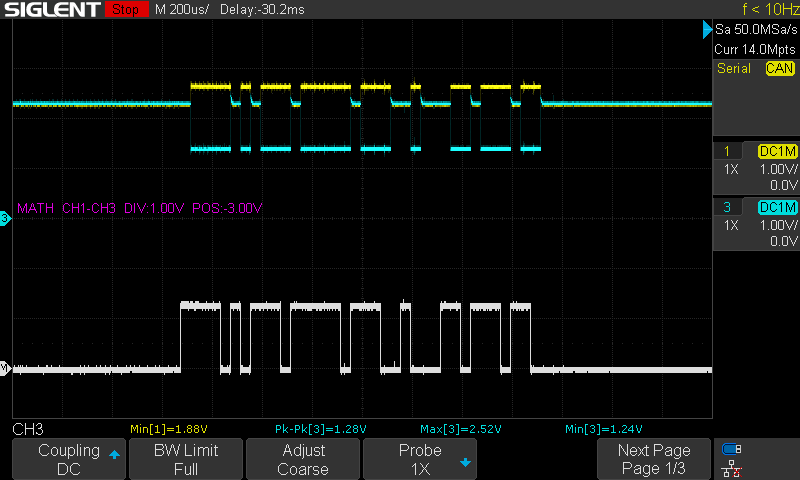
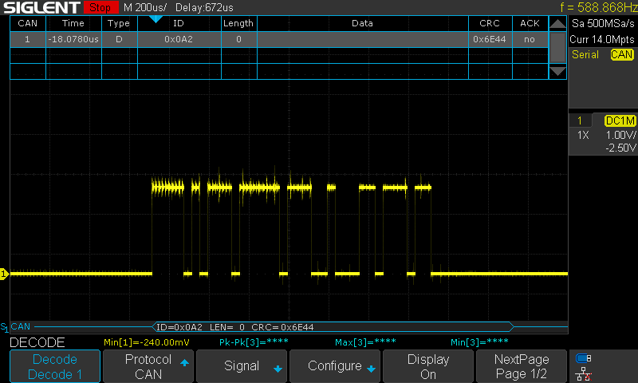
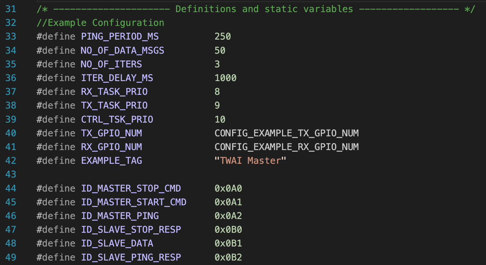
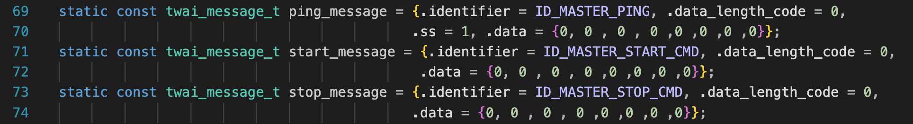

# ESP32 IDF Example

Directly coppied from IDF v5.0 and tested on two ESP32 boards.

## Oscilloscope Measurements

Using two channells on my oscilloscope, I was able to measure the CANH and CANL signals individually (both ground clips on the circuit ground and each measurement clip on the respective CAN line). The recessive (2.5V) and dominant (1.5V Low and 3.5V (ish) High) sections can be clearly seen. 

The math function channel calculating `CANH - CANL` is the bottom signal.

My oscilloscope also has a serial CAN decoding feature. Using a single channell (ground clip on CANL and measurement clip on CANH), setting up the trigger and "decode" feature with the following settings:
- Protocol: CAN
- Signal: 
    - Channel: CH1
    - Threshold: 200mV
- Configure: 
    - Baud Rate: Custom
    - Custom: 25kBaud
- Display: On
- List:
    - Display: Decode 1
    - Scroll: (I don't think this does anything)
    - Lines: 3
    - Can also export `.csv` files from here
- Format: Hex
- Tips Info: On (not sure what this does)

The decoded `ID = 0x0A2, Len = 0` is a good transition to the code :smile:.

## Code

The decoded message ID matches the `ID_MASTER_PING`

The decoded message Data matches the `ping_message`

